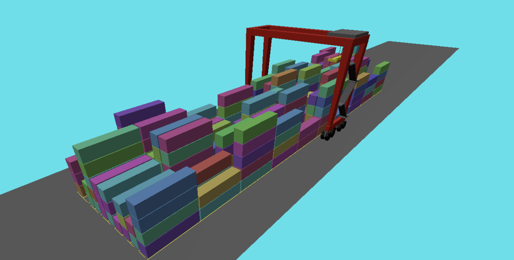

# RTG Simulation

> A 3D simulation of a Rubber Tyred Gantry (RTG) crane operating in a container yard, built with Three.js.



## Overview

This project simulates an RTG crane retrieving containers from a randomized yard stack. The crane autonomously selects containers, reshuffles blocking ones to free slots, picks the target container, and deposits it at the load-out lane — then repeats indefinitely.

Key behaviors:

- Randomly generates a container yard (10 sections × 10 rows × up to 6 tiers)
- Crane plans multi-step move sequences: reshuffle → pick → travel → deposit
- Multi-crane aware: task allocation respects neighboring crane positions to avoid collisions
- Containers are color-coded across 255 hues for visual identification
- Fully interactive camera via pan/zoom/rotate (Three.js `MapControls`)

## Prerequisites

- [Node.js](https://nodejs.org/) (v18+ recommended)

## Getting Started

```bash
npm install
npx vite
```

Then open your browser at the local address shown in the terminal (typically `http://localhost:5173`).

## Project Structure

```
src/
├── main.js          # Scene setup, crane animation loop, Three.js rendering
├── stack_logis.js   # Stack generation, task selection, move planning logic
├── index.html       # HTML entry point
└── RTG9+Spreader.blend  # Source Blender model
```

The GLTF crane model (`RTG9+Spreader.gltf`) is loaded at runtime. The spreader, machinery, cabin, and hoist lines are animated independently.

## Simulation Logic

`stack_logis.js` exports three functions:

| Function | Description |
|---|---|
| `generate_stack(sections, rows, tiers)` | Creates a randomized container yard |
| `generate_tasks(stack, n, rtg, allRtgs)` | Picks `n` retrieval tasks, bounded by neighboring crane positions |
| `generate_moves(stack, task)` | Plans the full move sequence for a task, mutating the stack state |

Move sequences follow this pattern:
1. Reshuffle containers above the target to the lowest available slot in the same section
2. Lower spreader onto the target container
3. Lift and travel to the load-out lane (row 10, tier 0)
4. Deposit and return spreader to the default raised position

## Tech Stack

- **JavaScript** (ES modules)
- **Three.js** — 3D rendering, GLTF loading, `MapControls`
- **Vite** — development server and bundler

## License

MIT
